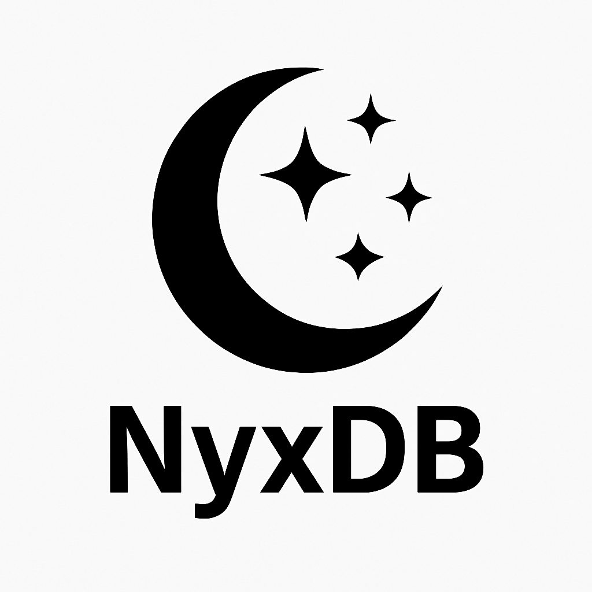

# NyxDB

English |  [简体中文](./README_zh.md)  <!-- 中文版本链接 -->



**NyxDB** is a distributed key-value store database built on the principles of the **LSM** (Log-Structured Merge Tree). It aims to provide high write performance and stable query responses. NyxDB uses a distributed architecture, capable of scaling horizontally to meet the needs of large-scale applications. It is suitable for scenarios that require fast writes and large data storage.

## Name Origin

**Nyx** is the Greek goddess of the night, symbolizing mystery and depth. We chose this name because **NyxDB** focuses on providing users with a **stable, efficient, and scalable storage engine**, much like the profound and quiet nature of the night, ensuring data security and reliability while running efficiently under heavy load in the background.

## Features

- **LSM Tree Based**: NyxDB uses the LSM tree as the storage engine, providing excellent performance in high-write scenarios.
- **Distributed Architecture**: Supports distributed deployment, capable of dynamically expanding nodes to accommodate large-scale data storage and high throughput demands.
- **Efficient Write Performance**: Thanks to the LSM tree design, NyxDB performs well in write-heavy applications, handling massive write operations efficiently.
- **Reliable Data Storage**: Supports Write-Ahead Logging (WAL) and periodic compaction mechanisms to ensure data consistency and persistence.
- **Horizontal Scalability**: Supports sharding and automatic load balancing through consistent hashing, enabling easy horizontal scaling for clusters.
- **Easy to Use**: Provides a simple API interface, supports common key-value operations, and can be seamlessly integrated into existing applications.

## Installation & Usage

### Installation

You can install NyxDB using the following command:

```bash
go get github.com/crazyfrankie/NyxDB
```

## Example
Here is a simple example using NyxDB:
```go
package main

import (
	"fmt"
	"log"
	
	"github.com/crazyfrankie/nyxdb"
)

func main() {
	// Create a new database instance
	db, err := nyxdb.New()
	if err != nil {
		log.Fatal(err)
	}

	// Set a key-value pair
	err = db.Put("key1", "value1")
	if err != nil {
		log.Fatal(err)
	}

	// Get the value for a key
	value, err := db.Get("key1")
	if err != nil {
		log.Fatal(err)
	}

	fmt.Println("key1 ->", value)

	// Delete a key-value pair
	err = db.Delete("key1")
	if err != nil {
		log.Fatal(err)
	}
}
```

## Configuration
NyxDB supports basic configuration settings, which you can modify in a configuration file to adjust the database behavior:
```yaml
server:
  port: 8080
  cluster: true
  nodes:
    - 192.168.1.1:9921
    - 192.168.1.2:9921

storage:
  compaction_interval: 3600
  memtable_size: 64MB
```

## Data Persistence
NyxDB provides persistence mechanisms where data is reliably stored through Write-Ahead Logging (WAL) and periodic compaction.


